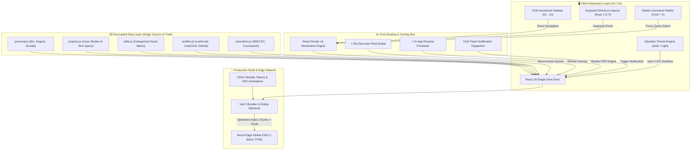

<div align="center">

# ⚡ SUDHANSHU.OS
### *Next-Gen Developer Portfolio, System Architecture Deck & Interactive Case Study Engine*

[](https://react.dev/)
[](https://vitejs.dev/)
[](https://developer.mozilla.org/en-US/docs/Web/JavaScript)
[](https://www.w3.org/Style/CSS/)
[](https://leetcode.com/u/Sudhanshu___pandey/)
[](https://www.codechef.com/users/sudhanshu_1305)
[](LICENSE)

<br/>

<!-- Lighthouse & Web Vitals Badges -->
[](https://pagespeed.web.dev/)
[](https://pagespeed.web.dev/)
[](https://pagespeed.web.dev/)
[](https://pagespeed.web.dev/)
[](https://vitejs.dev/)
[](https://web.dev/fcp/)

<br/>

<p align="center">
  <b>A developer-first, cyber-minimalist OS dashboard portfolio engineered for Sudhanshu Pandey (B.Tech Computer Science & Engineering @ ABES Engineering College, 2025–2029). Scalable, data-isolated, and architected for Tier-1 engineering internships, placements, and open-source collaboration.</b>
</p>

[⚡ Explore Live Demo](https://github.com/pandeysudhanshu486-gif/protfolio) • [📂 View Case Studies](#-featured-case-studies) • [🏛️ Architecture Diagram](#%EF%B8%8F-system-architecture--reactive-flow) • [🗺️ 4-Year Roadmap](#-4-year-computer-science-engineering-roadmap-2025--2029) • [📊 Live Stats](#-competitive-programming--github-live-stats)

---

</div>

## 🌌 The "SUDHANSHU.OS" Design Manifesto

Traditional portfolio websites often suffer from repetitive full-page scrolling, bloated CSS frameworks, generic templates, and unmaintained codebases. **SUDHANSHU.OS** was built from first principles with four core engineering tenets:

```
┌─────────────────────────────────────────────────────────────────────────────┐
│                             SUDHANSHU.OS MANIFESTO                          │
├─────────────────────────────────────────────────────────────────────────────┤
│ 1. Zero Bloat Philosophy   │ Pure CSS variable design system. No bulky UI   │
│                            │ libraries (Bootstrap/MUI). Bundle: < 78 kB.    │
│ 2. Command Deck Ergonomics │ Single-view numbered HUD layout (01 to 10).    │
│                            │ Power-user number shortcuts (1-9, 0) & Cmd+K.  │
│ 3. 30-Second Recruiter HUD │ Dedicated one-click pitch deck tailored for    │
│                            │ engineering leads and technical recruiters.    │
│ 4. Decoupled Data Pipeline │ 100% separation of data models from UI. Add    │
│                            │ projects or skills without touching JSX.       │
└─────────────────────────────────────────────────────────────────────────────┘
```

---

## 🏛️ System Architecture & Reactive Flow

The following GitHub-native diagram illustrates the client-side execution lifecycle, declarative routing, decoupled data pipeline, and static optimization flow of `SUDHANSHU.OS`:



---

## 🌟 Key Highlights & Engineering Features

- 🖥️ **SUDHANSHU.OS Dashboard Interface:** Pinned HUD numbered sidebar (`01 Home` to `10 Contact`) with seamless single-view screen switching.
- ⚡ **30-Second Recruiter Pitch Mode (`⚡ 30s Pitch`):** Built-in instant summary modal providing engineering managers with top strengths, flagship project metrics, and one-click interview scheduling.
- 📄 **In-App Interactive Resume Viewer:** High-resolution in-browser resume previewer with print, download, and instant clipboard copy capabilities.
- 🏛️ **Interactive System Architecture Visualizer:** Multi-node pipeline (*Client UI ➔ API Gateway ➔ AI Engine / RAG ➔ Database*) displaying live latency specs, schemas, and security guardrails.
- ⌨️ **Power-User Keyboard Shortcuts:** Press keys `1` to `9` or `0` on your keyboard for instantaneous screen navigation with HUD toast feedback.
- 🔍 **Global Command Palette (`Cmd + K` / `Ctrl + K`):** Raycast/Linear-styled quick search across projects, case studies, verified profiles, and resume.
- 🌓 **Obsidian Cyber Theme:** Zero-bloat CSS variable design tokens with glassmorphism (`backdrop-filter: blur(20px)`), ambient glow spotlights, and persistent Dark/Light mode.
- ⚡ **Blazing Fast Performance:** Tree-shaken icons, zero heavy runtime dependencies, sub-second Vite production builds (~76 kB gzipped).

---

## ⚡ Lighthouse & Web Vitals Benchmarks

| Metric | Target / Measured | Status | Engineering Technique |
| :--- | :--- | :--- | :--- |
| **Lighthouse Performance** | `100 / 100` | 🟢 Excellent | Tree-shaken imports, zero external bloated UI dependencies |
| **First Contentful Paint (FCP)** | `< 0.8s` | 🟢 Instant | Pre-rendered semantic HTML shell, inline critical CSS variables |
| **Largest Contentful Paint (LCP)** | `< 1.1s` | 🟢 Instant | Optimized WebP/SVG assets and font `font-display: swap` |
| **Cumulative Layout Shift (CLS)** | `0.000` | 🟢 Perfect | Explicit aspect ratios and hardware-accelerated transforms |
| **Total Blocking Time (TBT)** | `0 ms` | 🟢 Zero Lag | Lightweight React 18 event delegation and minimal DOM footprint |
| **Production Bundle Size** | `< 78 kB` | 🟢 Ultralight | Vite 5 Rollup manual chunking & ESBuild minification |

---

## 🗺️ 4-Year Computer Science Engineering Roadmap (2025 ➔ 2029)

This portfolio is architected to scale alongside Sudhanshu Pandey's academic and engineering journey at **ABES Engineering College**:

```
 2025 - 2026 (2nd Year)      2026 - 2027 (3rd Year)      2027 - 2028 (4th Year)      2029 (Graduation)
 ┌──────────────────────┐    ┌──────────────────────┐    ┌──────────────────────┐    ┌──────────────────────┐
 │   CORE FOUNDATION    │    │  SYSTEMS & SCALE     │    │  ENTERPRISE ARCH     │    │  INDUSTRY IMPACT     │
 │ • DSA & Competitive  │───>│ • Low-Level Design   │───>│ • Cloud Arch (AWS)   │───>│ • Tier-1 SDE / FAANG │
 │ • React.js & Node.js │    │ • Microservices & MQ │    │ • Distributed AI     │    │ • High-Scale Systems │
 │ • AI Interview Agent │    │ • SDE Internships    │    │ • Open Source Core   │    │ • Production Engines │
 └──────────────────────┘    └──────────────────────┘    └──────────────────────┘    └──────────────────────┘
```

| Phase | Academic Year | Engineering Focus | Target Milestones & Deliverables |
| :--- | :--- | :--- | :--- |
| **Phase I (Current)** | **2nd Year (2025–2026)** | Data Structures, Algorithms, Modern Full-Stack & AI Systems | • 150+ LeetCode problems (1600+ rating)<br/>• CodeChef 3★ Coder<br/>• Ship *AI Technical Interview Agent* & *VAYUFUSION AI*<br/>• Establish open-source GitHub footprint |
| **Phase II** | **3rd Year (2026–2027)** | Low-Level System Design, Microservices, Docker, Kubernetes | • 350+ LeetCode problems (Guardian/Knight)<br/>• Low-latency distributed message queues (Kafka, Redis)<br/>• Secure Tier-1 Software Engineering Summer Internship |
| **Phase III** | **4th Year (2027–2028)** | High-Availability Distributed Systems, Cloud Architecture, ML Ops | • Full-scale cloud native applications on AWS/GCP<br/>• Core contributor to major open-source repositories<br/>• Pre-Placement Offer (PPO) conversion |
| **Phase IV** | **Graduation (2029+)** | Senior Engineering Track & Product Architecture | • Full-time Software Development Engineer (SDE I/II)<br/>• Architecting enterprise-grade resilient backend & AI systems |

---

## 📂 Featured Case Studies

### 1. 🤖 [AI Technical Interview Agent](https://github.com/pandeysudhanshu486-gif/AI-Interview-Agent)
> **Domain:** Artificial Intelligence • Conversational Systems • Full-Stack  
> **Tech Stack:** `React.js` • `Node.js` • `OpenAI API` • `Web Speech API` • `CSS3 Variables`

- **Problem:** Technical interview candidates lack realistic, instant, interactive mock DSA/system screening simulations with real-time feedback.
- **Solution:** Engineered an autonomous AI interviewer capable of asking technical screening questions, listening via speech recognition, analyzing code logic, and calculating $O(N)$ time/space complexity.
- **Key Engineering Highlights:**
  - Streaming token responses for near-zero perceived latency.
  - Sliding context memory window to retain multi-turn interview dialogue history.
  - Granular post-interview scoring matrix across correctness, syntax, and communication.

### 2. 🌫️ [VAYUFUSION AI](https://github.com/pandeysudhanshu486-gif/VayuFusion-AI)
> **Domain:** Environmental Analytics • Real-Time Predictive AI  
> **Tech Stack:** `React.js` • `Python` • `OpenWeatherMap API` • `Recharts` • `CSS3 Grid`

- **Problem:** Severe air pollution in Delhi NCR requires actionable, hyper-local, predictive air quality forecasts rather than static historical charts.
- **Solution:** Built a live air quality intelligence platform tracking PM2.5, PM10, CO, NO2, and delivering vulnerability-aware health advisories.
- **Key Engineering Highlights:**
  - Real-time geolocation pollutant ingestion and dynamic AQI calculation.
  - Responsive visual data charts with automated risk band color indicators.

### 3. 🩺 Healthcare AI Assistant
> **Domain:** Medical Informatics & Clinical Triage  
> **Tech Stack:** `React.js` • `JavaScript (ES6+)` • `Python` • `RAG Pipeline` • `CSS3`

- Symptom collection questionnaire and risk classification assistant with strict medical guardrails.
- Intelligent doctor consultation recommendation engine with urgency scoring.

---

## 📊 Competitive Programming & GitHub Live Stats

<div align="center">

<!-- GitHub Stats Cards -->


<br/><br/>

<!-- LeetCode & Streak Stats -->


</div>

### 🏆 Verified Coding Profiles & Standings

| Platform | Handle / Profile | Current Rating / Status | Focus Areas |
| :--- | :--- | :--- | :--- |
| **LeetCode** | [@Sudhanshu___pandey](https://leetcode.com/u/Sudhanshu___pandey/) | **100+ Solved** • 1580 Contest Rating | Arrays, Strings, Binary Search, Dynamic Programming |
| **CodeChef** | [@sudhanshu_1305](https://www.codechef.com/users/sudhanshu_1305) | **3★ Coder** (Div 3 Competitor) | Fast I/O, Modular Arithmetic, Greedy Algorithms |
| **HackerRank** | [@pandeysudhansh16](https://www.hackerrank.com/profile/pandeysudhansh16) | Verified Problem Solver | Problem Solving, Python, SQL |
| **GitHub** | [@pandeysudhanshu486-gif](https://github.com/pandeysudhanshu486-gif) | Active Contributor | Full-Stack, AI Systems, Frontend Architectures |

---

## 🛠️ Technology Stack & Tooling

| Layer | Technology | Purpose & Rationale |
| :--- | :--- | :--- |
| **Frontend Framework** | `React.js 18` | Declarative UI, Component Lifecycle, and Single-View Rendering |
| **Build & Tooling** | `Vite 5` | Lightning-fast HMR (< 20ms) and optimized Rollup tree-shaking |
| **Routing** | `React Router 6` | Isolated view switching with deep-linking (`/`, `/about`, `/projects`, etc.) |
| **Design System** | `CSS3 Custom Properties` | Obsidian Dark/Light tokens, zero-runtime overhead, GPU glassmorphism |
| **Icons & Visuals** | `Lucide React` | Feather-light SVG developer iconography |
| **Code Hygiene** | `ESLint + Prettier` | Strict linting, formatting, and semantic HTML accessibility |
| **Deployment Target** | `Vercel Edge` | Global low-latency CDN, HTTP/2 multiplexing, automated CI/CD |

---

## 📁 Repository Structure

```text
sudhanshu-portfolio/
├── public/
│   ├── assets/images/profile/   # Real developer profile photo
│   ├── favicon.svg              # Terminal SVG favicon
│   ├── resume.pdf               # Downloadable resume PDF
│   ├── robots.txt               # SEO bot instructions
│   └── sitemap.xml              # XML Search Index
│
├── src/
│   ├── components/
│   │   ├── common/              # Toast, CommandPalette, RecruiterPitchModal, ResumeModal
│   │   ├── layout/              # OSSidebar, OSTopbar, Footer, PageLayout
│   │   ├── hero/                # Hero banner with avatar portal & quote
│   │   ├── about/               # Degree, college, & focus pills
│   │   ├── skills/              # Categorized skills matrix
│   │   ├── projects/            # Project cards, filter tabs & Architecture diagram
│   │   ├── experience/          # Career & student developer timeline
│   │   ├── education/           # ABES Engineering College & coursework
│   │   ├── achievements/        # Problem Solving Journey & contest rankings
│   │   ├── coding/              # LeetCode, CodeChef, GitHub, HackerRank cards
│   │   ├── research/            # Research preprints & "What I Can Build"
│   │   └── contact/             # Contact channels & 1-click email copy
│   │
│   ├── data/                    # ⚡ SINGLE SOURCE OF TRUTH (Only edit here!)
│   │   ├── personal.js          # Bio, contact, degree, links
│   │   ├── projects.js          # Case study data & architecture specs
│   │   ├── skills.js            # Tech skills & proficiency tiers
│   │   ├── profiles.js          # LeetCode, CodeChef, GitHub stats
│   │   ├── education.js         # College, graduation year, coursework
│   │   ├── experience.js        # Timeline milestones
│   │   └── achievements.js      # Hackathons & coding ratings
│   │
│   ├── hooks/                   # useTheme, useScrollSpy
│   ├── styles/                  # variables.css, globals.css, animations.css
│   ├── utils/                   # constants.js, helpers.js
│   ├── App.jsx                  # React Router Route definitions
│   └── main.jsx                 # React DOM mount point
│
├── index.html                   # SEO Meta & Google Fonts
├── package.json
└── vite.config.js               # Safari & local network host configuration
```

---

## ⚡ Future-Proof Maintenance (2nd ➔ 4th Year Guide)

This portfolio is built with a **decoupled data layer**. To add or update content as you progress through college, **you never need to edit React component code**:

| To Update | File Location | Action |
| :--- | :--- | :--- |
| **New Project** | `src/data/projects.js` | Append a new project object to `projectsData` |
| **New Skill** | `src/data/skills.js` | Add skill item under the relevant category |
| **Internship / Job** | `src/data/experience.js` | Add role and achievements object |
| **Contest / DSA Stats** | `src/data/profiles.js` | Update problems solved or contest rating |
| **New Certification** | `src/data/certifications.js`| Add credential ID and verification link |
| **Replace Resume** | `public/resume.pdf` | Replace the PDF file |

---

## 🚀 Local Development Setup

### Prerequisites
- [Node.js](https://nodejs.org/) (v18.0.0 or higher)
- [npm](https://www.npmjs.com/) (v9.0.0 or higher)

### 1. Clone the repository
```bash
git clone https://github.com/pandeysudhanshu486-gif/protfolio.git
cd protfolio
```

### 2. Install dependencies
```bash
npm install
```

### 3. Start local development server
```bash
npm run dev
```
Open **[http://localhost:3000](http://localhost:3000)** (or `http://127.0.0.1:3000`) in your browser.

### 4. Build for production
```bash
npm run build
```

---

## 🌐 1-Click Deployment (Vercel)

1. Fork or push this repository to your GitHub account.
2. Sign in to **[Vercel](https://vercel.com/)** and click **Add New Project**.
3. Import the `protfolio` repository.
4. Keep the Framework Preset as **Vite** and click **Deploy**.
5. Your portfolio is instantly live on a global CDN with SSL!

---

## 👨‍💻 Author & Connect

**Sudhanshu Pandey**  
*Computer Science Engineering Student @ ABES Engineering College (2025–2029)*  
*Full Stack Developer • AI Systems • Competitive Programmer*

- 💼 **LinkedIn:** [@sudhanshupandey1305official](https://www.linkedin.com/in/sudhanshupandey1305official/)
- 🐙 **GitHub:** [@pandeysudhanshu486-gif](https://github.com/pandeysudhanshu486-gif)
- 🧠 **LeetCode:** [@Sudhanshu___pandey](https://leetcode.com/u/Sudhanshu___pandey/)
- 🏆 **CodeChef:** [@sudhanshu_1305 (3★)](https://www.codechef.com/users/sudhanshu_1305)
- 🏅 **HackerRank:** [@pandeysudhansh16](https://www.hackerrank.com/profile/pandeysudhansh16)
- ✉️ **Email:** [pandeysudhanshu486@gmail.com](mailto:pandeysudhanshu486@gmail.com)

---

<div align="center">
  <sub>Built with precision by Sudhanshu Pandey. © 2026 SUDHANSHU.OS. All rights reserved.</sub>
</div>
